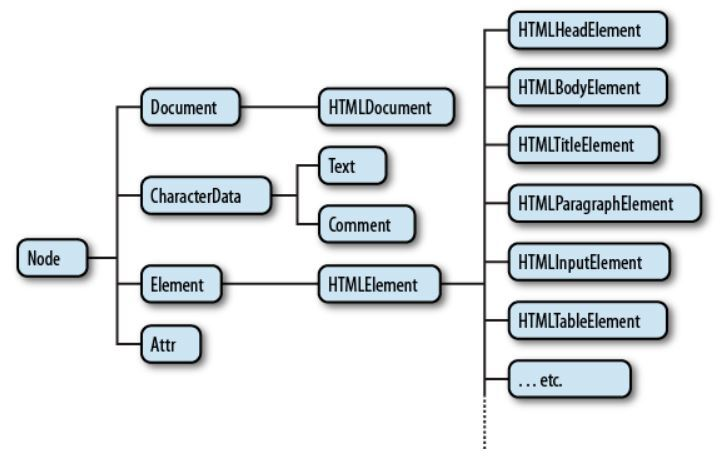

### DOM API란?
DOM은 이전 글에서 적었듯 Document Object Model의 약자이다.<br/>
API는 Application Programming Interface로 명령들의 집합이라 보면 된다. 따라서 DOM API는 **HTML의 요소들을 JS로 제어하기 위한 명령들의 집합**이다.<br/>
<br/>
DOM API로 가장 많이 쓰이는 interface는 Document와 Window이다.<br/>
Document는 DOM 트리의 진입점 역할을 수행한다.<br/>
Window 인터페이스는 DOM 문서를 담은 창을 나타낸다. 각 탭마다 window 객체를 가지고 있다.<br/>

#### DOM의 Node와 Element의 차이점

DOM은 노드 트리이다. 그저 text일 뿐이라도 Node 형태로 표현 된다는 것이다.

```
<p>Hello</p>
```
> p 태그 또한 Node이지만 Hello 또한 text Node이다.<br/>
반면에 Element는 HTML에서 태그로 적은 노드들을 지칭힌다.

#### NodeList vs HTML Collection
NodeList는 전체 노드의 List이고, HTML Collection은 element만을 담을 수 있다.<br/>
이 둘의 차이점을 예시로 보자
```
<p>
    <b> Hello </b> I am Yoonlang!
</p>
```
p 태그의 childNodes(**NodeList**)와 children(**HTMLCollection**)의 결과가 다르다.
```
// NodeList       [HTMLElement, text]
// HTMLCollection [HTMLElement]
```
결과를 보자면 NodeList는 Hello를 포함하는 b 태그의 HTMLElement와 I am Yoonlang!이라는 text를 가지고 있다. 하지만 HTMLCollection은 HTMLElement 하나만 가지고 있고, 이것이 b 태그임을 알 수 있다.


### 참고
[MDN - Node](https://developer.mozilla.org/ko/docs/Web/API/Node)<br/>
[MDN - Window](https://developer.mozilla.org/ko/docs/Web/API/Window)<br/>
[MDN - Document](https://developer.mozilla.org/ko/docs/Web/API/Document)<br/>
[DOM은 무엇인가? DOM Node와 Element 차이 - yejinlee님](https://velog.io/@yejineee/DOM%EC%9D%80-%EB%AC%B4%EC%97%87%EC%9D%B8%EA%B0%80-DOM-Node%EC%99%80-Element%EC%9D%98-%EC%B0%A8%EC%9D%B4)<br/>
[What, exactly, is the DOM?](https://bitsofco.de/what-exactly-is-the-dom/?utm_source=CSS-Weekly&utm_campaign=Issue-341&utm_medium=email)<br/>
[element, node 차이. Collection, NodeList 차이](https://humahumahuma.tistory.com/123)<br/>
