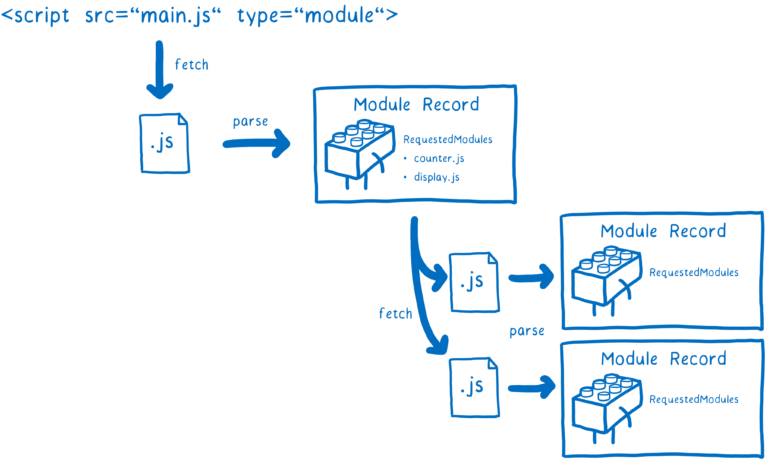

### ES Module 이란?
ES 모듈은 자바스크립트의 공식 모듈이다.<br/>
그렇다면 자바스크립트 모듈은 무엇일까?<br/>

#### Javascript Module 이란?
자바스크립트 모듈을 알기 위해 이해해야 할 과정이 있다.
1. 기존의 웹은 자바스크립트의 비중이 크지 않았고, 따라서 큰 스크립트가 필요하지 않았다.
2. 웹의 발전에 따라 점점 자바스크립트의 중요도가 커지고, 여러 스크립트 파일을 쓰며 상호작용해야 했다.
3. 이를 처리하기 위해 JQuery 등으로 해결했지만 여러 문제점이 발생했다.
4. 이에 따라 각 파일 간의 상호작용을 위해 모듈화한다.

Node.js에선 이미 CommonJS와 같은 모듈 시스템이 존재했고, ES module은 자바스크립트 최신 모듈 시스템이다.

### 모듈은 어떻게 동작하는 걸까?

#### ES 모듈의 진행 순서 3단계


#### 구성
1. 모듈이 들어있는 파일을 어디서 다운 받을 것인지 확인
2. 파일 가져오기 (URL or File system)
    진입점 파일 찾기
    ```
    <script src="main.js" type="module">
    ```
    type="module"을 통해 진입점을 확인한다.<br/>
    다음 모듈은 import를 통해 찾을 수 있다.
    
3. 파일 구문 분석

#### 인스턴스 화
이제 import와 export 한 것들이 메모리에 연결되어야 한다. 먼저 export부터 연결하는데, 모듈 그래프를 인스턴스 화하기 위해 **깊이 우선 탐색**을 한다.
모든 의존의 최하단까지 도달 후 export를 설정한다. 그 후 import를 연결한다.


##### 라이브 바인딩이란?
Node.js의 모듈 시스템인 CommonJS는 위의 인스턴스 과정에서 export 객체가 메모리에 올라갈 때, 복제된 값이 올라간다. 
따라서 인스턴스 과정이 끝나고, export 하는 모듈에서 값 수정이 일어나도 import 하는 모듈에선 알 수 있는 방법이 없다.
이에 반해 ES 모듈은 **라이브 바인딩**을 사용한다. 위 사진처럼 export 하는 모듈과 import 하는 모듈이 같은 메모리 주소에 접근한다.

### 평가
메모리에 값을 부여하는 단계<br/>
평가 단계에서 한 모듈은 한 번만 평가한다.<br/>
> 평가 단계는 코드를 실행하는 단계인데, 여러 번 실행하게 되면 값이 변경될 수도 있기 때문. 따라서 이를 처리하기 위해 **모듈맵**을 이용하여 깊이 우선 탐색을 통해 처리한다.

#### 모듈맵
자료구조 map을 떠올리면 된다.<br/>
모듈들을 URL을 통해 관리한다.


### ES Module은 순환 의존성을 지원한다
앞서 말했듯 ES Module에서는 라이브 바인딩을 사용한다. 따라서 순환 구조가 발생해도 빈 객체를 반환한다. 하지만 CommonJS는 라이브 바인딩이 아니고 사본을 메모리에 넣기 때문에 사이클이 생기면 처리할 수 없다.


### 참고 
[MDN - JS Modules](https://developer.mozilla.org/ko/docs/Web/JavaScript/Guide/Modules)
[ES modules: 만화로 보는 심층 탐구](https://ui.toast.com/weekly-pick/ko_20180402)
