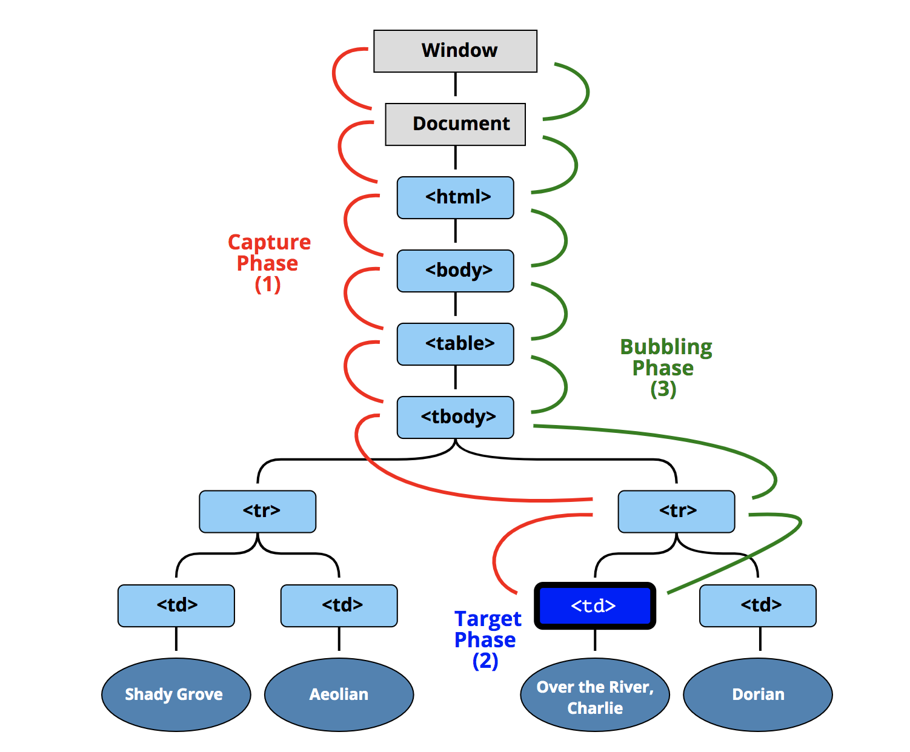

### 이벤트 위임이란?
이벤트 핸들링 패턴 중 하나이다.<br/>
이벤트를 다양한 요소에 할당해야 할 때, 공통 조상에 하나만 할당해도 여러 요소를 한꺼번에 다룰 수 있다.

#### 유의해야할 점
**event.target**을 통해 이벤트가 일어난 요소를 알 수 있다.<br/>
하지만 내가 원하는 요소 하위 요소에서 이벤트가 발생 시 event.target은 하위 요소로 나타난다.
이를 어떻게 처리할까?

#### 해결책
```
let td = event.target.closet('td);
```
closet을 쓰면 가장 근접한 조상 요소를 반환한다.

### 버블링과 캡쳐링


#### 버블링
버블링은 이벤트가 발생한 요소의 조상들에게 이벤트가 전달되는 현상이다.

#### 캡쳐링
캡쳐링은 이벤트가 부모에게서 전달되어 내려오는 현상이다.<br/>
캡쳐링같은 경우 이벤트 핸들러를 설정할 때, 옵션을 넣어야해서 default는 캡쳐링하지 않는다.

#### stopPropagation
event.Propagation()을 통해 캡쳐링 및 버블링을 막을 수 있다.

### 참고
[이벤트 위임 문서](https://ko.javascript.info/event-delegation)<br/>
[이벤트 위임 - moonheekim0118님](https://velog.io/@moonheekim0118/JavaScript-%EC%9D%B4%EB%B2%A4%ED%8A%B8-%EB%B2%84%EB%B8%94%EB%A7%81)<br/>
[이벤트 버블링, 이벤트 캡처 그리고 이벤트 위임까지](https://joshua1988.github.io/web-development/javascript/event-propagation-delegation/)

